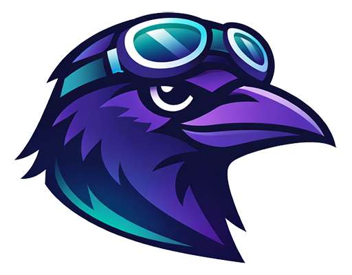
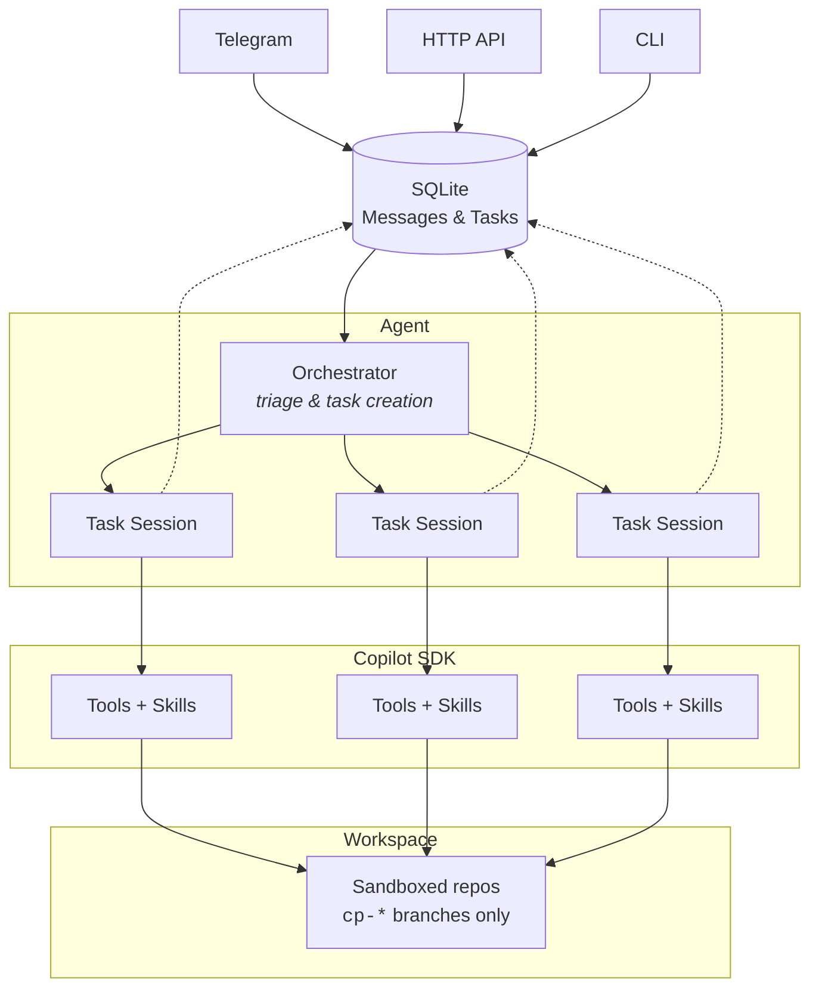

<div align="center">



# cawpilot

**Always-on autonomous agent, powered by GitHub Copilot SDK.**

[](https://nodejs.org/)
[](https://www.typescriptlang.org/)
[](https://github.com/github/copilot-sdk)
[](LICENSE)

[Features](#features) · [Getting Started](#getting-started) · [Usage](#usage) · [Architecture](#architecture) · [Skills](#skills) · [Configuration](#configuration)

</div>

---

cawpilot is a personal agent assistant that runs in the background, takes your requests through natural conversation, and gets things done autonomously. It manages code, branches, pull requests, and any workflow you throw at it — as long as you bring the right [skills](https://agentskills.io).

It operates in a dedicated sandboxed workspace, cloning your connected repositories and working exclusively in branches (unless you say otherwise).

> [!IMPORTANT]
> cawpilot is built on the GitHub Copilot SDK which is currently in **Technical Preview**. Consider it an experimental project at this stage.

## Features

- 🤖 **Copilot-powered agent** — full Copilot SDK with planning, tool invocation, and code editing
- 💬 **Multi-channel** — Telegram, HTTP API, and CLI with a unified interface (more to come)
- 🔀 **Parallel task processing** — groups related messages into tasks, runs them concurrently
- 🔒 **Branch safety** — only works in `cp-*` branches to protect your main codebase
- 🧩 **Extensible skills** — plug in any capability via standard `SKILL.md` files
- ⏰ **Scheduled tasks** — recurring tasks like daily standups, weekly code cleanups, and more
- 🔗 **GitHub-native** — creates PRs, manages repos, persists config in a private repo
- 🔑 **BYOK** — bring your own API key (OpenAI, Azure, Ollama etc.) instead of a Copilot subscription

## Getting Started

Pick the installation method that suits you best.

### Option 1: Local Install

**Prerequisites:** [Node.js 24+](https://nodejs.org/), [GitHub CLI](https://cli.github.com/) (`gh`), [Copilot CLI](https://docs.github.com/en/copilot/how-tos/set-up/install-copilot-cli), and a [GitHub Copilot subscription](https://github.com/features/copilot#pricing) (free tier works).

```bash
npm install -g cawpilot
```

Then run the interactive setup and start the agent:

```bash
cawpilot setup
cawpilot start
```

### Option 2: Docker

**Prerequisites:** [Docker](https://docs.docker.com/get-docker/)

Everything is bundled inside the image — no Node.js, `gh`, or Copilot CLI install needed on your machine.

```bash
# Build the image
docker build -t cawpilot .

# Run interactive setup (workspace is persisted via bind mount)
docker run -it --rm -v ./workspace:/workspace cawpilot setup

# Start the bot
docker run -it --rm \
  -v ./workspace:/workspace \
  -p 2243:2243 \
  cawpilot start
```

> [!TIP]
> The workspace bind mount persists your configuration, database, and cloned repositories across container restarts.

<details>
<summary>GitHub authentication in Docker</summary>

Since `gh auth login` is interactive, pass a token via environment variable instead:

```bash
docker run -it --rm \
  -v ./workspace:/workspace \
  -e GH_TOKEN=ghp_your_token_here \
  cawpilot start
```
</details>

### Option 3: Azure (Cloud)

**Prerequisites:** [Docker](https://docs.docker.com/get-docker/), [Azure Developer CLI](https://aka.ms/azd) (`azd`), and an Azure subscription.

Deploy to Azure Container Apps with a single command:

```bash
cd cloud/azure
azd up
```

After deployment, `azd` outputs a **setup URL** — open it in your browser to complete the setup wizard (GitHub auth, channels, model, skills). The container restarts automatically into normal mode once setup is done.

<details>
<summary>Optional: pre-configure secrets before deployment</summary>

```bash
azd env set GH_TOKEN ghp_...
azd env set TELEGRAM_TOKEN 123:ABC...
azd up
```
</details>

## Usage

### CLI Commands

| Command | Description |
|---------|-------------|
| `cawpilot setup` | Interactive onboarding and configuration |
| `cawpilot start` | Start the agent with live dashboard |
| `cawpilot doctor` | Run diagnostics (auth, config, connectivity) |
| `cawpilot send <msg>` | Send a message from the CLI channel |

### Talking to cawpilot

Send messages through any connected channel:

```
You: Create a utility function to format dates in the api-server repo
Bot: On it. Creating branch cp-add-date-formatter…
     Done — PR ready: https://github.com/…
```

### Telegram Setup

During `cawpilot setup`, if you select Telegram:
1. Create a bot via [BotFather](https://core.telegram.org/bots#botfather) and enter the token
2. A pairing code is generated — send it to your bot to link your account

## Architecture



**How it works:**

1. Messages arrive from any channel and are stored in SQLite
2. The orchestrator polls for new messages and groups them into tasks via the LLM
3. Each task gets its own Copilot SDK session with tools and skills
4. Tasks run in parallel (default: 5 concurrent), results are reported back through channels
5. Completed tasks are archived to `.cawpilot/archive/`

## Skills

Skills are modular capabilities loaded at runtime. Each skill is a directory with a `SKILL.md` file describing its purpose and instructions.

### Built-in Skills

| Skill | Description |
|-------|-------------|
| **github** | GitHub repository operations, PR management |
| **public-tunnel** | Expose local ports publicly for demos |
| **skill-creator** | Create new skills interactively |

#### Adding Custom Skills

Bundled skills are limited voluntarily to a minimum, to reduce default expose and keep space for customization.
You can ask the agent to create new skills on the fly using the built-in `skill-creator` skill.

Note that skills aren't limited to development: you can create skills for any workflow: content writing, data analysis, deployment pipelines, or anything else you can describe.

## Configuration

Configuration lives in `<workspace>/.cawpilot/config.json`:

- Connected channels and credentials
- Selected repositories
- Enabled built-in skills
- Scheduling rules
- Max task concurrency (default: 5)

### Persistence

Optionally sync configuration to a private GitHub repository (default: `<user>/my-cawpilot`) to back up, share across machines, and version-control your setup.

## Contributing

See [CONTRIBUTING.md](.github/CONTRIBUTING.md) for local dev setup, coding guidelines, and project structure.
